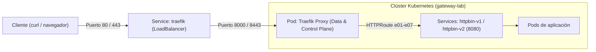

# Implementación de Gateway API con Traefik

| Campo | Valor |
|---|---|
| Integrantes | Esteban Guarin Valencia<br>Valeria Ortiz Zulueta |
| Rama | `equipo/traefik` |
| Versión del controlador | Traefik v3.7.14 (Chart traefik-41.7.0) |
| Versión de Gateway API | v1.6.2 (Canal Standard) |
| Clúster y versión de Kubernetes | Minikube v1.39.0 / Kubernetes v1.37.0 (driver Docker) |

---

## 1. Descripción

Traefik es un proxy inverso moderno y API Gateway de código abierto mantenido por Traefik Labs. En entornos Kubernetes, opera como controlador de tráfico para la especificación Gateway API (`gateway.networking.k8s.io`), permitiendo el enrutamiento de peticiones L7 sin depender de anotaciones propietarias ni del controlador obsoleto `ingress-nginx`.

---

## 2. Arquitectura

A diferencia de soluciones que desacoplan el plano de control (operador) del plano de datos (proxies dedicados por Gateway), Traefik unifica ambas funciones dentro del mismo componente:
- **Plano de control**: El pod de Traefik observa el API Server de Kubernetes buscando recursos `GatewayClass`, `Gateway` y `HTTPRoute`.
- **Plano de datos**: El mismo proceso de Traefik actúa como proxy de alto rendimiento, escuchando el tráfico externo y aplicándole reglas de filtrado y balanceo.

### Flujo de una petición
1. El cliente envía la petición a un hostname bajo el dominio `*.lab.local`.
2. El tráfico ingresa al Service `traefik` de tipo `LoadBalancer` en los puertos 80 (HTTP) o 443 (HTTPS).
3. El Service reenvía la petición al pod de Traefik en sus entrypoints internos (`web`: 8000, `websecure`: 8443).
4. Traefik evalúa las reglas declaradas en el `Gateway` y en los `HTTPRoute` correspondientes.
5. El proxy despacha la petición al Service backend (`httpbin-v1` o `httpbin-v2`) en el puerto 8080.



---

## 3. Requisitos

- **Kubernetes**: v1.31 o superior (utilizado: v1.37.0 sobre Minikube v1.39.0).
- **CRDs de Gateway API**: v1.6.2 (Canal Standard instalado con `standard-install.yaml`).
- **Herramientas cliente**: `kubectl` v1.37.1+, `helm` v3/v4 y `minikube tunnel` activo.
- **Memoria y CPU mínimos**: 2 CPU y 4 GB de memoria RAM asignados a Minikube.

Evidencias relacionadas:
- Estado del clúster: [`evidencias/minikube-status.png`](evidencias/minikube-status.png)
- Nodo de trabajo: [`evidencias/kubectl-get-nodes-wide-1.png`](evidencias/kubectl-get-nodes-wide-1.png)
- Túnel de red activo: [`evidencias/minikube-tunnel-status.png`](evidencias/minikube-tunnel-status.png)
- CRDs registrados: [`evidencias/gateway-api-crds-list.png`](evidencias/gateway-api-crds-list.png)

---

## 4. Instalación

El procedimiento detallado paso a paso se encuentra documentado en [`instalacion/instalación.md`](instalacion/instalación.md). El resumen de comandos ejecutados es el siguiente:

1. **Instalación de CRDs de Gateway API**:
   ```bash
   kubectl apply --server-side=true -f https://github.com/kubernetes-sigs/gateway-api/releases/download/v1.6.2/standard-install.yaml
   ```

2. **Creación del namespace para el controlador**:
   ```bash
   kubectl create namespace traefik
   ```

3. **Configuración del repositorio Helm**:
   ```bash
   helm repo add traefik https://traefik.github.io/charts
   helm repo update
   ```

4. **Despliegue del chart de Traefik con valores personalizados**:
   ```bash
   helm upgrade --install traefik traefik/traefik \
     --namespace traefik \
     --values traefik/instalacion/values.yaml
   ```

Evidencias de instalación:
- Pod de Traefik en estado Running: [`evidencias/traefik-pod-running.png`](evidencias/traefik-pod-running.png)
- Service LoadBalancer con IP asignada: [`evidencias/traefik-svc-loadbalancer.png`](evidencias/traefik-svc-loadbalancer.png)

---

## 5. GatewayClass y Gateway

### 5.1 GatewayClass
Traefik registra automáticamente la `GatewayClass` con nombre `traefik` y controlador `traefik.io/gateway-controller`.
- Evidencia de clase aceptada: [`evidencias/gatewayclass-traefik-accepted.png`](evidencias/gatewayclass-traefik-accepted.png)

### 5.2 Overlay Kustomize (`traefik/manifests/kustomization.yaml`)
El archivo Kustomize enlaza la base común del repositorio (`../../comun`) y aplica los siguientes parches necesarios para Traefik:
```yaml
apiVersion: kustomize.config.k8s.io/v1beta1
kind: Kustomization
resources:
  - ../../comun
patches:
  - target:
      kind: Gateway
      name: gateway
    patch: |-
      - op: replace
        path: /spec/gatewayClassName
        value: traefik
      - op: replace
        path: /spec/listeners/0/port
        value: 8000
      - op: replace
        path: /spec/listeners/1/port
        value: 8443
```

*Justificación técnica:* Traefik exige que los puertos de los listeners coincidan con los puertos internos de sus entrypoints dentro del pod (8000 para `web` y 8443 para `websecure`). El Service externo continúa recibiendo el tráfico en los puertos convencionales 80 y 443.

- Evidencia de previsualización: [`evidencias/kustomize-preview-gateway-ports.png`](evidencias/kustomize-preview-gateway-ports.png)
- Gateway programado con dirección asignada: [`evidencias/gateway-status-programmed.png`](evidencias/gateway-status-programmed.png)

---

## 6. Escenarios comunes

Las pruebas automatizadas del script [`scripts/verificar.sh`](../scripts/verificar.sh) se ejecutaron contra el Gateway, validando los 7 escenarios descritos en [`docs/04-escenarios.md`](../docs/04-escenarios.md).

```text
Gateway: gateway-lab/gateway  Dirección: 10.108.164.101  HTTP: 80  HTTPS: 443

PASS  E01  Enrutamiento por hostname y path
PASS  E02  Matching por header x-version
PASS  E03  Pesos 80/20 (20/100 hacia v2)
PASS  E04  Modificación de headers de petición y respuesta
PASS  E05  Rewrite /api/<ruta> hacia /<ruta>
PASS  E06  Redirección HTTP a HTTPS (301)
PASS  E07  Terminación TLS

Fallos: 0/7
```

| ID | Resultado | Observaciones |
|---|---|---|
| E01 | PASS | Enrutamiento exitoso por hostname `enrutamiento.lab.local` y ruta `/get` (HTTP 200). |
| E02 | PASS | Enrutamiento condicional por cabecera `x-version: v2` dirigido a `httpbin-v2`. |
| E03 | PASS | Distribución de tráfico ponderada 80/20 comprobada estadísticamente en 100 peticiones. |
| E04 | PASS | Inyección correcta de cabeceras en petición y respuesta (`RequestHeaderModifier` y `ResponseHeaderModifier`). |
| E05 | PASS | Reescritura de prefijo URL `/api/...` a `/...` (`URLRewrite` soporte Extended). |
| E06 | PASS | Redirección forzada de HTTP a HTTPS retornando código de estado 301 (`RequestRedirect`). |
| E07 | PASS | Terminación TLS exitosa en el Gateway utilizando el Secret `gateway-tls` (HTTPS 200). |

- Evidencia de ejecución: [`evidencias/verificar-escenarios-pass.png`](evidencias/verificar-escenarios-pass.png)

---

## 7. Comportamiento específico

1. **Emparejamiento estricto de puertos de Listeners**:
   A diferencia de otros controladores que crean dinámicamente puertos y listeners en el plano de datos, Traefik rechaza cualquier listener de un recurso `Gateway` cuyo puerto no coincida con un entrypoint predefinido en su configuración estática. Esto motivó el ajuste del overlay Kustomize a los puertos 8000 y 8443.
2. **Propagación de direcciones de red**:
   Para que el recurso `Gateway` exponga su dirección en `status.addresses`, Traefik requiere configurar explícitamente `providers.kubernetesGateway.statusAddress.service` en el archivo `values.yaml`, vinculándolo al Service del balanceador.

---

## 8. Extensiones del controlador

No aplica. Se utilizaron exclusivamente las capacidades estándar de Kubernetes Gateway API (`Gateway`, `GatewayClass`, `HTTPRoute`) provistas en la base común, confirmando el cumplimiento nativo de la especificación sin requerir CRDs privativos como `IngressRoute` o `Middleware`.

---

## 9. Troubleshooting

| Síntoma | Causa | Solución |
|---|---|---|
| Gateway en estado no programado (`no matching entryPoint for port 80`) | Los listeners del Gateway definen puertos 80/443, pero el pod escucha en 8000/8443. | Aplicar el overlay Kustomize que parchea los puertos de los listeners a 8000 y 8443. |
| Service `traefik` con `EXTERNAL-IP` en `<pending>` | Minikube se ejecuta en un host local sin proveedor de nube integrado. | Iniciar `minikube tunnel` en una terminal con privilegios administrativos. |
| Error al aplicar el listener HTTPS por Secret no encontrado | No se generó previamente el Secret `gateway-tls`. | Ejecutar `scripts/crear-certificado.sh` antes de desplegar el overlay de Kustomize. |

---

## 10. Limpieza

Para desmantelar todos los recursos creados durante las pruebas:

```bash
# 1. Eliminar recursos del laboratorio y namespace gateway-lab
kubectl delete -k traefik/manifests

# 2. Desinstalar Traefik y su namespace
helm uninstall traefik --namespace traefik
kubectl delete namespace traefik

# 3. Eliminar los CRDs de Gateway API
kubectl delete -f https://github.com/kubernetes-sigs/gateway-api/releases/download/v1.6.2/standard-install.yaml

# 4. Detener el clúster local
minikube stop
```

---

## 11. Análisis

- **Ventajas**: Arquitectura ligera en un solo binario; no requiere múltiples pods auxiliares ni operadores pesados; soporte nativo completo para las características Core y Extended evaluadas (incluyendo reescritura de URL y manipulación de cabeceras).
- **Limitaciones**: Requiere correspondencia rígida entre los puertos de los listeners del Gateway y los entrypoints estáticos definidos en la instalación del chart.
- **Nivel de conformidad**: Excelente. Superó el 100% de los escenarios del laboratorio (0 fallos en 7 pruebas), demostrando ser un reemplazo directo y robusto frente a la retirada de `ingress-nginx`.

---

## 12. Referencias

- Documentación oficial de Traefik Gateway API: <https://doc.traefik.io/reference/routing-configuration/kubernetes/gateway-api>
- Chart oficial de Traefik: <https://github.com/traefik/traefik-helm-chart>
- Especificación oficial de Gateway API: <https://gateway-api.sigs.k8s.io/>
- Bitácora de instalación paso a paso: [`instalacion/instalación.md`](instalacion/instalación.md)

---

## Checklist

- [x] Secciones completas o con motivo de omisión justificado.
- [x] `scripts/verificar.sh` ejecutado y salida incluida en la sección 6.
- [x] Evidencias en `evidencias/` referenciadas con enlaces relativos válidos.
- [x] Versiones explícitas de todos los componentes documentadas.
