# Instalación y configuración de Traefik como implementación de Gateway API

## 1. Introducción

Este documento registra el procedimiento técnico de instalación, configuración y verificación de Traefik v3 como implementación de Kubernetes Gateway API en un clúster local gestionado con Minikube. El procedimiento forma parte del repositorio `gateway-api-lab` y se desarrolla exclusivamente en la carpeta `traefik/`, sobre la rama `equipo/traefik`.

Gateway API es el sucesor del recurso `Ingress`. Define un modelo desacoplado en tres recursos principales:

| Recurso | Ámbito | Función |
|---|---|---|
| `GatewayClass` | Clúster | Declara el controlador que implementa los Gateways. |
| `Gateway` | Namespace | Define los listeners: puertos, protocolos, hostnames y TLS. |
| `HTTPRoute` | Namespace | Define las reglas de enrutamiento hacia los Services. |

### 1.1 Componentes utilizados

| Componente | Función en el laboratorio |
|---|---|
| Minikube | Provee un clúster Kubernetes de un solo nodo en la máquina local. |
| kubectl | Cliente de línea de comandos para operar el clúster. Incluye Kustomize mediante la opción `-k`. |
| Helm | Gestor de paquetes de Kubernetes. Instala Traefik a partir de su chart oficial. |
| Kustomize | Permite definir un overlay sobre los manifiestos comunes del repositorio sin modificarlos. |
| Traefik v3 | Proxy inverso que actúa como controlador de Gateway API. |
| Gateway API | Conjunto de CRDs del grupo `gateway.networking.k8s.io`. Versión utilizada: v1.6.2. |

### 1.2 Estructura de trabajo

```text
traefik/
├── README.md          Documentación según plantillas/PLANTILLA-implementacion.md
├── instalacion/       Este documento y values.yaml de Helm
├── manifests/         Overlay kustomize sobre comun/
└── evidencias/        Capturas, salidas de comandos y diagramas
```

Todos los comandos de este documento se ejecutan desde la raíz del repositorio, salvo que se indique lo contrario.

---

## 2. Requisitos y verificación de herramientas

### 2.1 Versiones de las herramientas

```bash
kubectl version --client
```

Muestra la versión del cliente `kubectl`.

```bash
helm version
```

Confirma que Helm está instalado. Se requiere Helm 3.

```bash
docker version
```

Confirma que el runtime de contenedores utilizado por Minikube está disponible y en ejecución.

```bash
minikube version
```

Muestra la versión de Minikube instalada.

### 2.2 Requisito de versión de Kubernetes

El repositorio establece Kubernetes 1.31 o superior como requisito para los CRDs de Gateway API v1.6, cuyas reglas de validación CEL dependen de funcionalidades presentes desde esa versión. La versión del servidor se consulta con:

```bash
kubectl version
```

La salida incluye `Client Version` y `Server Version`. El valor de `Server Version` debe ser 1.31 o superior.

### 2.3 Compatibilidad entre Traefik y Gateway API

Cada versión de Traefik soporta una versión determinada de la especificación de Gateway API. La versión soportada por la versión de Traefik instalada debe consultarse en la documentación oficial del proveedor Kubernetes Gateway de Traefik (sección Referencias) y compararse con la versión de los CRDs instalados (v1.6.2).

---

## 3. Preparación del repositorio

### 3.1 Clonación y selección de rama

```bash
git clone https://github.com/Melo088/gateway-api-lab.git
cd gateway-api-lab
git switch equipo/traefik
```

Descarga el repositorio y cambia a la rama asignada a la implementación de Traefik. La rama `main` está protegida y solo recibe cambios mediante Pull Request.

### 3.2 Verificación de la rama activa

```bash
git branch --show-current
```

La salida debe ser `equipo/traefik`.

---

## 4. Preparación del entorno con Minikube

Minikube crea un clúster Kubernetes de un solo nodo sobre la máquina local. El nodo ejecuta el plano de control y las cargas de trabajo. El driver `docker` ejecuta el nodo como un contenedor.

### 4.1 Inicio del clúster

```bash
minikube start --driver=docker
```

Crea e inicia el nodo del clúster utilizando Docker como driver y configura el contexto de `kubectl` para apuntar a él.

### 4.2 Verificación del estado del clúster

```bash
minikube status
```
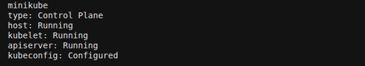

Los componentes `host`, `kubelet` y `apiserver` deben estar en estado `Running`, y `kubeconfig` en estado `Configured`.

```bash
kubectl config current-context
```

Muestra el contexto activo de `kubectl`. El valor esperado es `minikube`.

```bash
kubectl cluster-info
```

Muestra la dirección del servidor de API y de los servicios principales del clúster.

```bash
kubectl get nodes -o wide
```

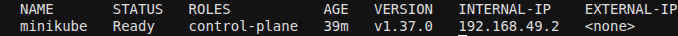
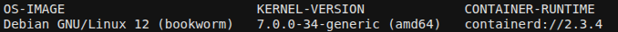

El nodo `minikube` debe aparecer en estado `Ready`. La columna `VERSION` indica la versión de Kubernetes en ejecución.

### 4.3 Túnel de red para Services de tipo LoadBalancer

En un entorno local, los Services de tipo `LoadBalancer` no reciben una dirección externa de un proveedor de nube. Minikube resuelve esto con un túnel de red:

```bash
minikube tunnel
```
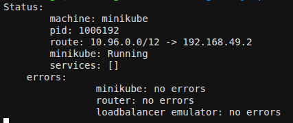

El comando se ejecuta en una terminal dedicada y debe permanecer activo mientras se utilicen los Services de tipo `LoadBalancer`. Puede solicitar credenciales de administrador para enlazar puertos privilegiados (80 y 443). En Windows se ejecuta desde una terminal con privilegios de administrador. Con el driver `docker`, la dirección externa asignada suele ser `127.0.0.1`.

---

## 5. Instalación de los CRDs de Gateway API

Kubernetes no incluye de forma nativa los CRDs de Gateway API. Deben instalarse antes de iniciar cualquier controlador. Se utiliza el canal Standard en la versión v1.6.2, la misma que documenta el repositorio.

### 5.1 Aplicación de los CRDs

```bash
kubectl apply --server-side=true -f https://github.com/kubernetes-sigs/gateway-api/releases/download/v1.6.2/standard-install.yaml
```

Registra en el servidor de API los recursos del canal Standard: `GatewayClass`, `Gateway`, `HTTPRoute`, `GRPCRoute`, `ReferenceGrant`, entre otros. La opción `--server-side=true` evita superar el límite de tamaño de la anotación `last-applied-configuration` que genera la aplicación del lado del cliente.

### 5.2 Verificación de los CRDs

```bash
kubectl get crd | grep gateway.networking.k8s.io
```
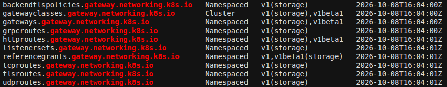

Deben listarse los CRDs del grupo `gateway.networking.k8s.io`.

```bash
kubectl get crd gateways.gateway.networking.k8s.io -o jsonpath='{.metadata.annotations.gateway\.networking\.k8s\.io/bundle-version}{"\n"}'
```

Muestra la versión del conjunto de CRDs instalado. El valor esperado es `v1.6.2`.

```bash
kubectl get gatewayclass
```

La lista debe estar vacía, porque aún no hay un controlador instalado.

---

## 6. Instalación del controlador Traefik

Traefik actúa como plano de datos (proxy inverso) y como plano de control, ya que observa los recursos de Gateway API y configura el enrutamiento.

### 6.1 Creación del namespace

```bash
kubectl create namespace traefik
```
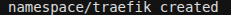
Aísla los componentes del controlador del resto de las aplicaciones del clúster.

```bash
kubectl get namespace traefik
```


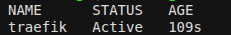
El namespace debe aparecer en estado `Active`.

### 6.2 Archivo de valores de Helm

Se crea el archivo `traefik/instalacion/values.yaml` con el siguiente contenido:

```yaml
providers:
  kubernetesGateway:
    enabled: true
    statusAddress:
      service:
        name: traefik
        namespace: traefik
  kubernetesCRD:
    enabled: false
  kubernetesIngress:
    enabled: false

gateway:
  enabled: false

gatewayClass:
  enabled: true

ports:
  web:
    port: 8000
    exposedPort: 80
    protocol: TCP
  websecure:
    port: 8443
    exposedPort: 443
    protocol: TCP

service:
  type: LoadBalancer
```

| Valor | Descripción |
|---|---|
| `providers.kubernetesGateway.enabled` | Habilita el proveedor que procesa los recursos de Gateway API. |
| `providers.kubernetesGateway.statusAddress.service` | Indica el Service cuya dirección externa se publica en `status.addresses` del Gateway. El script de verificación utiliza ese valor. |
| `providers.kubernetesCRD.enabled` | Deshabilitado. El laboratorio no utiliza los recursos `IngressRoute` propios de Traefik. |
| `providers.kubernetesIngress.enabled` | Deshabilitado. El laboratorio no utiliza el recurso `Ingress`. |
| `gateway.enabled` | Deshabilitado. El laboratorio define su propio Gateway en `comun/`, por lo que no se crea el Gateway por defecto del chart. |
| `gatewayClass.enabled` | Solicita la creación de la `GatewayClass` llamada `traefik`. |
| `ports.web` y `ports.websecure` | Puertos de los entrypoints de Traefik dentro del pod (`port`) y puertos expuestos por el Service (`exposedPort`). |
| `service.type` | `LoadBalancer`, para obtener la dirección externa mediante `minikube tunnel`. |

Los entrypoints del pod escuchan en los puertos 8000 y 8443. Esta relación determina la configuración del overlay descrita en la sección 7.

### 6.3 Despliegue con Helm

```bash
helm repo add traefik https://traefik.github.io/charts
```
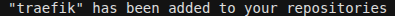
Registra el repositorio oficial de charts de Traefik.

```bash
helm repo update
```
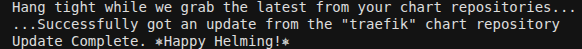
Actualiza el índice de charts disponibles.

```bash
helm search repo traefik/traefik
```
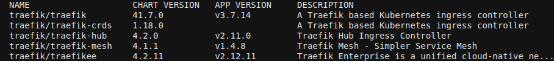

Muestra la versión del chart y la versión de la aplicación que se instalarán. Estos valores se registran como parte de las versiones utilizadas.

```bash
helm upgrade --install traefik traefik/traefik \
  --namespace traefik \
  --values traefik/instalacion/values.yaml
```

Instala Traefik en el namespace `traefik` con la configuración definida en `values.yaml`. El comando es idempotente: instala si el release no existe y actualiza si ya existe.
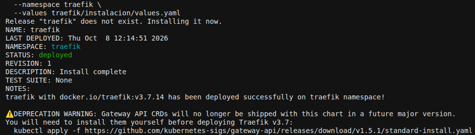

Sobre el aviso de advertencia (DEPRECATION WARNING): indica simplemente que en versiones futuras de la gráfica Helm ya no incluirán los CRDs de Gateway API por defecto. Como ya se instalaron manualmente con kubectl apply -f ..., se está completamente cubierto.

### 6.4 Verificación de la instalación

```bash
helm list --namespace traefik
```
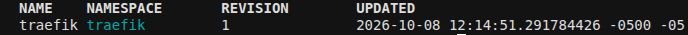
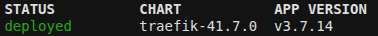
El release `traefik` debe aparecer con estado `deployed`.

```bash
kubectl -n traefik get pods -l app.kubernetes.io/name=traefik
```
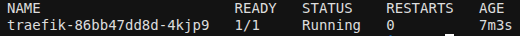
El pod de Traefik debe estar en estado `Running` y con `READY 1/1`.

```bash
kubectl -n traefik get svc traefik
```
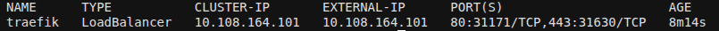
El Service debe ser de tipo `LoadBalancer` y mostrar una dirección en la columna `EXTERNAL-IP`. Si aparece `<pending>`, verificar que `minikube tunnel` esté activo.

```bash
kubectl get gatewayclass
```
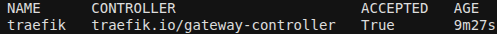
Debe existir la `GatewayClass` `traefik` con el controlador `traefik.io/gateway-controller`.

```bash
kubectl get gatewayclass traefik -o jsonpath='{.status.conditions[?(@.type=="Accepted")].status}{"\n"}'
```

El valor esperado es `True`, que indica que el controlador aceptó la clase.

Si la `GatewayClass` no existe, consultar la sección 11.3.

### 6.5 Registro de versiones utilizadas

| Componente | Comando | Valor |
|---|---|---|
| Gateway API (CRDs) | Sección 5.2 | v1.6.2 |
| Kubernetes (servidor) | `kubectl version` | v1.37.0  |
| Minikube | `minikube version` | v1.39.0 |
| Helm | `helm version` | v4.3.0 |
| Chart de Traefik y versión de la aplicación | `helm list --namespace traefik` | `CHART` traefik-41.7.0<br>`APP VERSION` v3.7.14 |

---

## 7. Overlay de Kustomize

El Gateway definido en `comun/base/gateway.yaml` se declara con `gatewayClassName: sin-definir` y dos listeners:

| Listener | Protocolo | Puerto | Hostname |
|---|---|---|---|
| `http` | HTTP | 80 | `*.lab.local` |
| `https` | HTTPS | 443 | `*.lab.local` |

Traefik solo acepta un listener si su puerto coincide con el de un entrypoint del pod. Los entrypoints escuchan en los puertos 8000 (`web`) y 8443 (`websecure`), mientras que el Service expone los puertos 80 y 443. Un listener en el puerto 80 provoca que el Gateway sea rechazado con el mensaje `no matching entryPoint for port 80`. Por esta razón el overlay reemplaza, además de `gatewayClassName`, los puertos de los listeners. La documentación `docs/04-escenarios.md` del repositorio prevé este ajuste para los controladores que lo exigen.

### 7.1 Archivo `traefik/manifests/kustomization.yaml`

```yaml
apiVersion: kustomize.config.k8s.io/v1beta1
kind: Kustomization
resources:
  - ../../comun
patches:
  - target:
      kind: Gateway
      name: gateway
    patch: |-
      - op: replace
        path: /spec/gatewayClassName
        value: traefik
      - op: replace
        path: /spec/listeners/0/port
        value: 8000
      - op: replace
        path: /spec/listeners/1/port
        value: 8443
```

| Operación | Efecto |
|---|---|
| `/spec/gatewayClassName` | Asocia el Gateway a la `GatewayClass` `traefik`. |
| `/spec/listeners/0/port` | Cambia el listener `http` del puerto 80 al 8000. |
| `/spec/listeners/1/port` | Cambia el listener `https` del puerto 443 al 8443. |

Los puertos externos no cambian: el Service sigue exponiendo 80 y 443 y los redirige a 8000 y 8443 del pod.

### 7.2 Previsualización del resultado

```bash
kubectl kustomize traefik/manifests | grep -nE 'gatewayClassName|^ +port: (8000|8443|80|443)$'
```
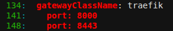
Debe mostrarse `gatewayClassName: traefik` y los puertos 8000 y 8443 en los listeners.

---

## 8. Certificado TLS

El listener `https` requiere el Secret `gateway-tls` en el namespace `gateway-lab`.

### 8.1 Revisión del script

```bash
cat scripts/crear-certificado.sh
```
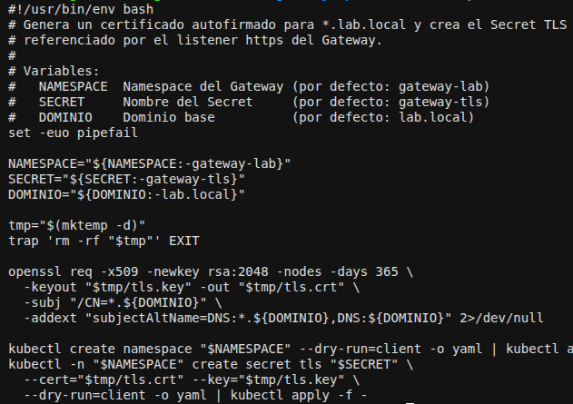
Permite verificar las herramientas que requiere el script y los recursos que crea. Los scripts `.sh` requieren un intérprete `bash`; en Windows se ejecutan desde WSL o Git Bash.

### 8.2 Ejecución

```bash
scripts/crear-certificado.sh
```
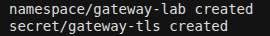
Genera un certificado autofirmado para `*.lab.local` y crea con él el Secret `gateway-tls`.

### 8.3 Verificación

```bash
kubectl -n gateway-lab get secret gateway-tls
```
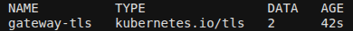
El Secret debe existir con tipo `kubernetes.io/tls`.

---

## 9. Aplicación de los manifiestos del laboratorio

### 9.1 Aplicación

```bash
kubectl apply -k traefik/manifests
```
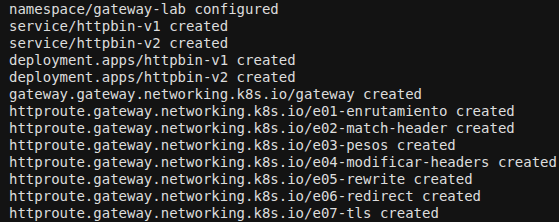
Crea el namespace `gateway-lab`, los backends `httpbin-v1` y `httpbin-v2` con sus Services, el Gateway y las siete HTTPRoute de los escenarios E01 a E07.

### 9.2 Verificación de los backends

```bash
kubectl -n gateway-lab get pods
```
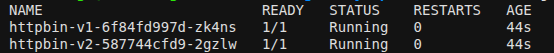
Los pods `httpbin-v1` y `httpbin-v2` deben estar en estado `Running` y `READY 1/1`.

```bash
kubectl -n gateway-lab wait --for=condition=Available deployment --all --timeout=120s
```
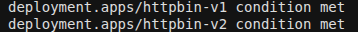
Espera a que ambos Deployments estén disponibles.

```bash
kubectl -n gateway-lab get svc
```
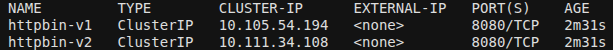
Deben existir los Services `httpbin-v1` y `httpbin-v2` en el puerto 8080.

### 9.3 Verificación del Gateway

```bash
kubectl -n gateway-lab get gateway gateway
```
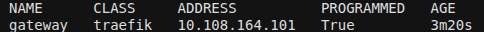
La columna `CLASS` debe ser `traefik`, `PROGRAMMED` debe ser `True` y `ADDRESS` debe mostrar una dirección.

```bash
kubectl -n gateway-lab describe gateway gateway
```
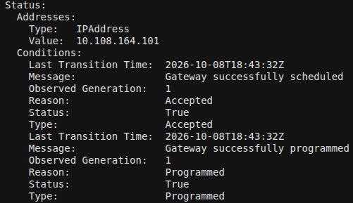
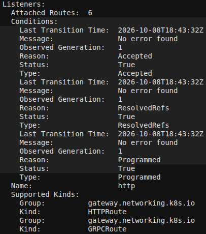
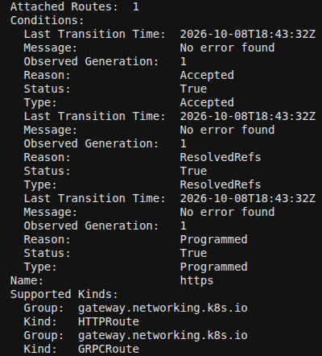
En la sección `Status` deben aparecer las condiciones `Accepted` y `Programmed` en `True`, y cada listener (`http` y `https`) debe tener `Accepted`, `Programmed` y `ResolvedRefs` en `True`.

### 9.4 Verificación de las rutas

```bash
kubectl -n gateway-lab get httproute
```
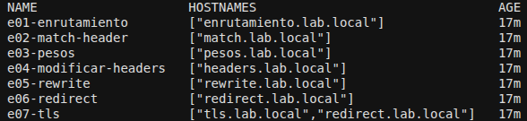
Deben listarse las siete rutas `e01-enrutamiento` a `e07-tls`.

```bash
kubectl -n gateway-lab get httproute -o custom-columns='NAME:.metadata.name,ACCEPTED:.status.parents[0].conditions[?(@.type=="Accepted")].status,RESOLVEDREFS:.status.parents[0].conditions[?(@.type=="ResolvedRefs")].status'
```

Todas las rutas deben mostrar `True` en ambas columnas.

---

## 10. Ejecución de los escenarios

### 10.1 Dirección de acceso al Gateway

```bash
kubectl -n gateway-lab get gateway gateway -o jsonpath='{.status.addresses[0].value}{"\n"}'
```

Muestra la dirección que el script de verificación utiliza como destino. Con `minikube tunnel` activo y el driver `docker`, el valor suele ser `127.0.0.1`.

### 10.2 Script de verificación

```bash
scripts/verificar.sh
```
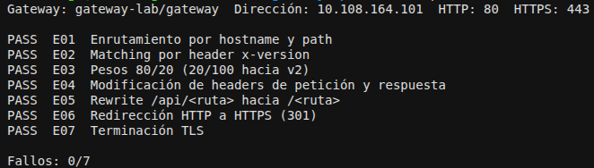
Envía peticiones HTTP y HTTPS a los siete escenarios mediante `curl --connect-to`, por lo que no requiere entradas en `/etc/hosts` ni DNS. Reporta `PASS` o `FAIL` por cada escenario.

### 10.3 Resultados esperados

| ID | Hostname | Funcionalidad | Resultado esperado |
|---|---|---|---|
| E01 | `enrutamiento.lab.local` | Enrutamiento por hostname y path | 200 en `GET /get` |
| E02 | `match.lab.local` | Matching por header `x-version: v2` | `httpbin-v2` con el header, `httpbin-v1` sin él |
| E03 | `pesos.lab.local` | Distribución 80/20 | Entre 8 y 35 respuestas de `httpbin-v2` en 100 peticiones |
| E04 | `headers.lab.local` | Modificación de headers de petición y respuesta | `x-gateway-lab` en la petición recibida y en la respuesta |
| E05 | `rewrite.lab.local` | Reescritura de path `/api/<ruta>` a `/<ruta>` | 200 en `GET /api/status/200` |
| E06 | `redirect.lab.local` | Redirección HTTP a HTTPS | 301 con `Location: https://redirect.lab.local/...` |
| E07 | `tls.lab.local` | Terminación TLS en el Gateway | 200 en `GET https://.../get` |

E04 y E05 corresponden a funcionalidades de nivel Extended. Si alguna no está implementada, el resultado se documenta junto con la alternativa propia del controlador, si existe.

### 10.4 Acceso mediante port-forward

Si el Gateway no obtiene dirección, el acceso alternativo es un reenvío de puertos hacia el Service de Traefik:

```bash
kubectl -n traefik port-forward svc/traefik 8080:80 8443:443
```

En otra terminal:

```bash
GATEWAY_ADDRESS=127.0.0.1 HTTP_PORT=8080 HTTPS_PORT=8443 scripts/verificar.sh
```

### 10.5 Prueba manual de un escenario

```bash
curl -i --connect-to enrutamiento.lab.local:80:<direccion>:80 http://enrutamiento.lab.local/get
```

Prueba E01 sin depender del script. `<direccion>` es el valor obtenido en la sección 10.1.

```bash
curl -ik --connect-to tls.lab.local:443:<direccion>:443 https://tls.lab.local/get
```

Prueba E07. La opción `-k` omite la validación del certificado autofirmado.

---

## 11. Resolución de problemas

### 11.1 Gateway rechazado: `no matching entryPoint`

Síntoma: el Gateway no muestra `Accepted` o `Programmed` en `True`.

Diagnóstico:

```bash
kubectl -n gateway-lab describe gateway gateway
kubectl -n traefik logs deployment/traefik
```

Causa: el puerto de un listener no coincide con el de un entrypoint de Traefik.

Solución: verificar que el overlay reemplace los puertos de los listeners por 8000 y 8443 (sección 7) y que `ports.web.port` y `ports.websecure.port` en `values.yaml` tengan esos mismos valores.

### 11.2 Service con `EXTERNAL-IP` en `<pending>`

Síntoma: `kubectl -n traefik get svc traefik` muestra `<pending>`.

Causa: `minikube tunnel` no está en ejecución.

Solución: iniciar `minikube tunnel` en una terminal dedicada. Como alternativa, utilizar el acceso por port-forward de la sección 10.4.

### 11.3 La GatewayClass no existe

Síntoma: `kubectl get gatewayclass` no lista `traefik` después de instalar el chart.

Causa: el chart condiciona la creación de la `GatewayClass` a la configuración del proveedor Gateway y del Gateway por defecto.

Solución: crear el archivo `traefik/manifests/gatewayclass.yaml`:

```yaml
apiVersion: gateway.networking.k8s.io/v1
kind: GatewayClass
metadata:
  name: traefik
spec:
  controllerName: traefik.io/gateway-controller
```

Y agregarlo a la lista `resources` de `traefik/manifests/kustomization.yaml`:

```yaml
resources:
  - ../../comun
  - gatewayclass.yaml
```

Posteriormente se vuelve a ejecutar `kubectl apply -k traefik/manifests`.

### 11.4 Error al crear el Secret por namespace inexistente

Síntoma: `scripts/crear-certificado.sh` falla porque el namespace `gateway-lab` no existe.

Solución: aplicar primero `kubectl apply -k traefik/manifests`, ejecutar después el script y verificar el Secret con el comando de la sección 8.3.

### 11.5 Conflicto de CRDs durante la instalación con Helm

Síntoma: `helm upgrade --install` informa de conflictos con CRDs de Gateway API ya instalados.

Causa: el chart de Traefik incluye CRDs que coinciden con los instalados manualmente en la sección 5.

Solución: repetir la instalación añadiendo la opción `--skip-crds` al comando de la sección 6.3.

### 11.6 Rutas sin aceptar

Síntoma: una HTTPRoute no muestra `Accepted` en `True`.

Diagnóstico:

```bash
kubectl -n gateway-lab describe httproute <nombre>
```

Causa habitual: el Gateway asociado no está programado (secciones 11.1 y 11.3) o el Secret `gateway-tls` no existe, lo que afecta al listener `https` y a la ruta E07.

---

## 12. Limpieza

```bash
kubectl delete -k traefik/manifests
```

Elimina el namespace `gateway-lab` y todos los recursos del laboratorio.

```bash
helm uninstall traefik --namespace traefik
kubectl delete namespace traefik
```

Desinstala Traefik y elimina su namespace. Si la `GatewayClass` fue creada manualmente (sección 11.3), se elimina con `kubectl delete gatewayclass traefik`.

```bash
kubectl delete -f https://github.com/kubernetes-sigs/gateway-api/releases/download/v1.6.2/standard-install.yaml
```

Elimina los CRDs de Gateway API. Esta operación borra también todos los recursos de Gateway API existentes en el clúster, por lo que solo debe ejecutarse si ninguna otra implementación los utiliza.

```bash
minikube stop
```

Detiene el clúster conservando su estado. `minikube delete` lo elimina por completo.

---

## 13. Referencias

- Traefik, Kubernetes Gateway API: <https://doc.traefik.io/reference/routing-configuration/kubernetes/gateway-api>
- Traefik Helm chart: <https://github.com/traefik/traefik-helm-chart>
- Gateway API: <https://gateway-api.sigs.k8s.io/>
- Minikube: <https://minikube.sigs.k8s.io/docs/>
- kubectl: <https://kubernetes.io/docs/reference/kubectl/>
- Helm: <https://helm.sh/docs/>
- Kustomize: <https://kubectl.docs.kubernetes.io/references/kustomize/>